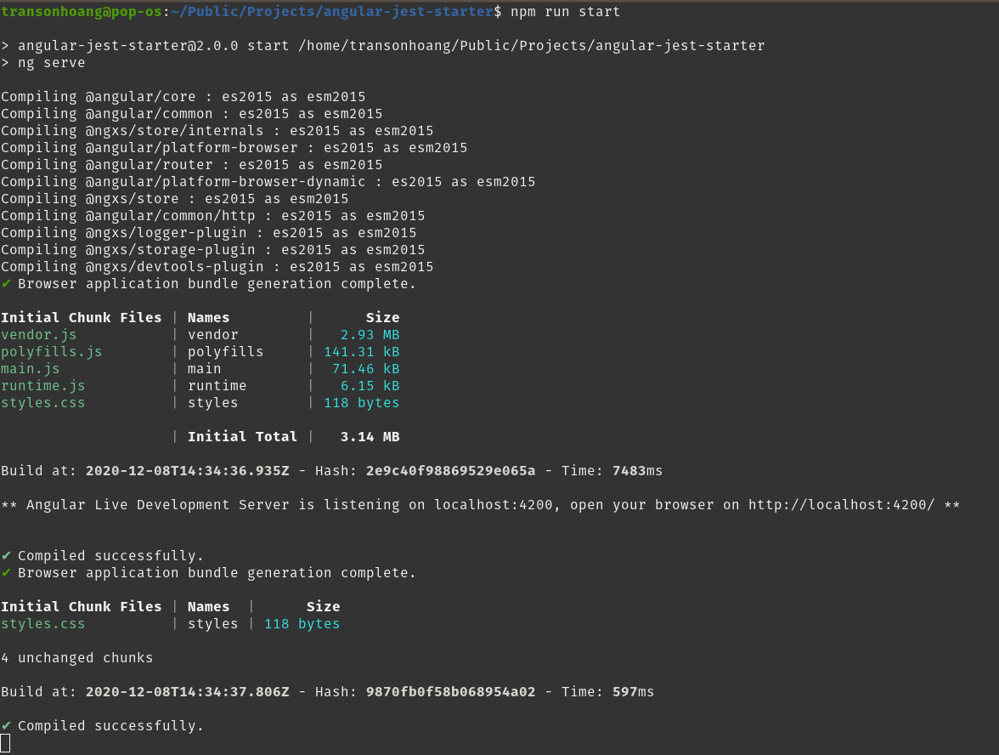
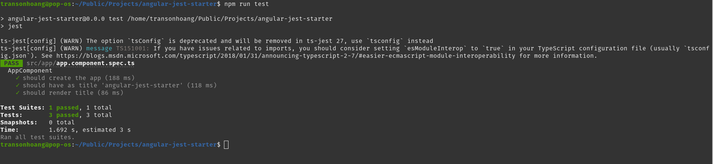
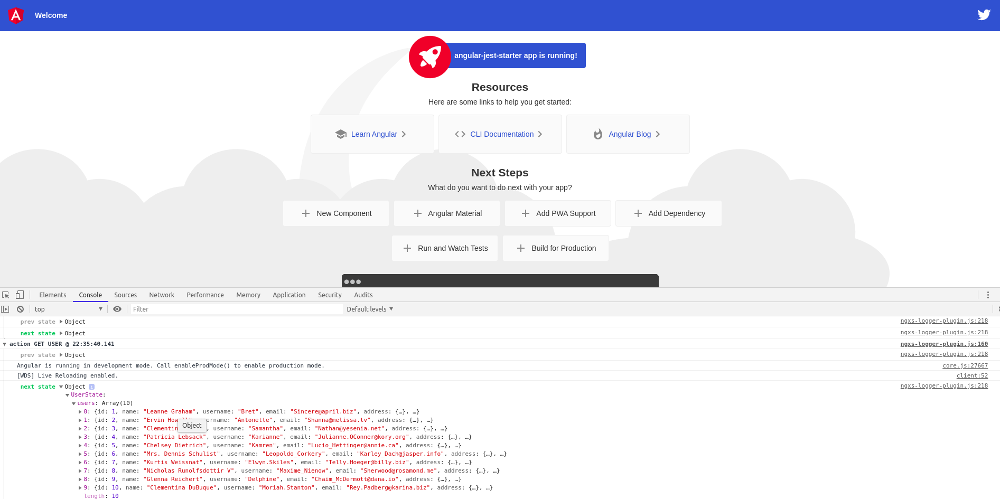
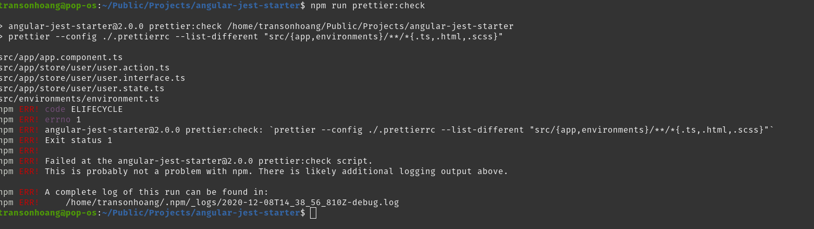
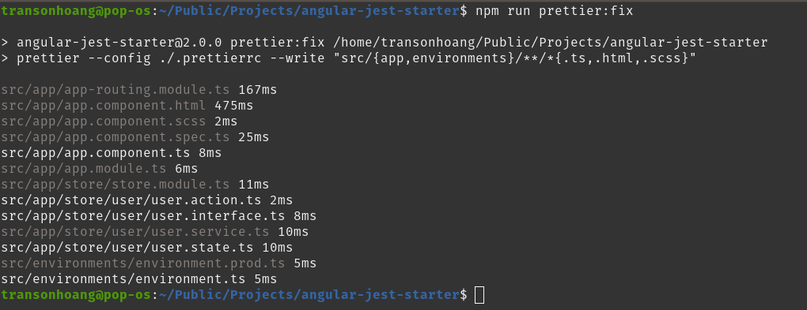

# Angular Jest Starter

This project was generated with [Angular CLI](https://github.com/angular/angular-cli) version 11.0.3.

## Installation

```
git clone https://github.com/hoangtranson/angular-jest-starter.git
cd angular-jest-starter
npm i
```

## Features

- [x] Angular 11
- [x] Jest
- [x] Ngxs State Management
- [x] Prettier
- [ ] ESLint
- [ ] Sample Admin Page

## Angular 11

run `npm run start` to start project.



## Unit Test with Jest

Run unit test with command `npm run test`




## State Management

This starter project is using Ngxs as state management.



## Prettier

Run `npm run prettier:check` to check files that not have good format.



Run `npm run prettier:fix` to format all files that not have good format that we see at `npm run prettier:check`.

